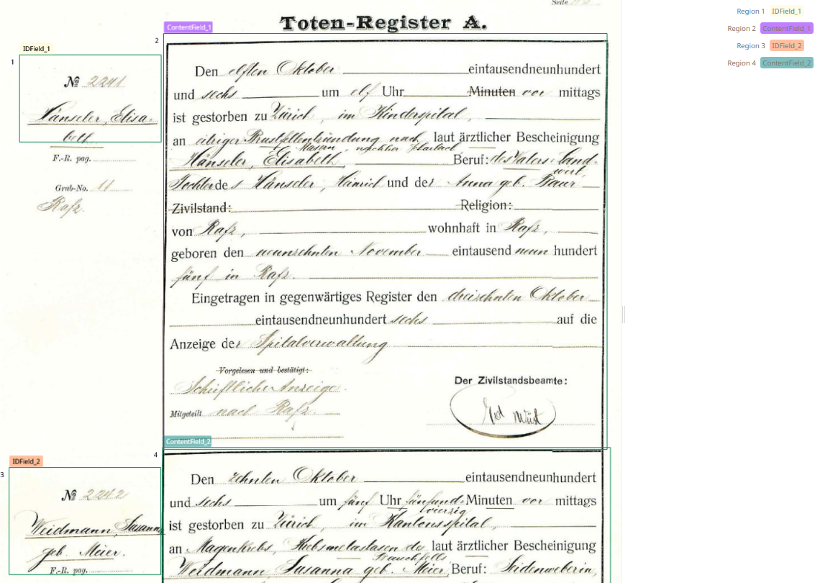
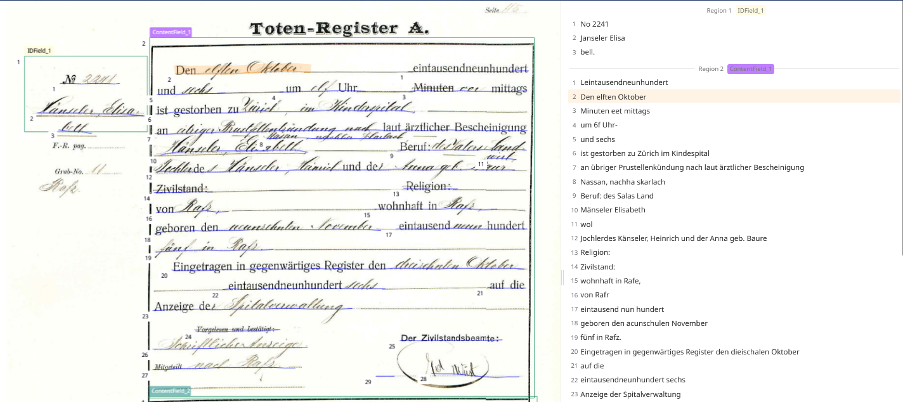
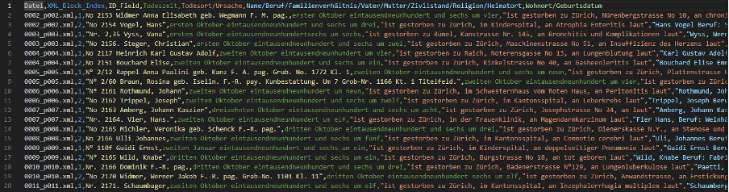

# death_register_extraction
Extraction of Zurich death register entries using OCR + layout analysis + LLM post-processing.

**Project Background**
This project operationalizes the workflow described in the poster "Informationsextraktion serieller Quellen: Die Zürcher Sterberegister (1876–1925)". The goal is to convert scanned serial sources (e.g., civil and church registers) into structured tables without manual correction by combining layout analysis, automatic text recognition (ATR), and large language models (LLMs). The project evaluates closed (Transkribus, OpenAI) and open (YOLO, TrOCR) toolchains to deliver a reproducible pipeline for historical sources.

**Poster Workflow Summary**
1. Layout and line segmentation to isolate entries and separate name vs. content areas.
2. ATR for handwritten and printed text (Transkribus and TrOCR models).
3. LLM-based reconstruction and extraction to normalize order and identify fields via keyword windows.
4. Validation and correction to quantify errors and improve models or apply rule-based fixes.

**Poster Figures (From Project Documentation)**

Figure 1: Document with layout regions marked (Transkribus screenshot, Fields model, Zurich 1876 register).

Figure 2: Layout/line segmentation + OCR output showing disrupted line order (Transkribus screenshot).

Figure 3: CSV output after segmentation, OCR, extraction, and post-processing (VSC screenshot).

**What This Repo Does**
This repo contains several standalone scripts that form a loose pipeline for:
1. Segmenting page images/PDFs into regions and lines (YOLO).
2. Performing OCR on line crops (TrOCR).
3. Converting OCR output into PAGE-XML for downstream tools.
4. Extracting structured fields from PAGE-XML and/or raw CSV via LLMs.

The scripts are currently configured with **hardcoded local paths** and **hardcoded API keys**. You will need to change those constants before running.

**Scripts Overview**
- `regions_lines_trocr.py`  
  Runs YOLO text-region + text-line segmentation and TrOCR.  
  Inputs: images/PDFs in `IMAGE_FOLDER`.  
  Outputs: overlays, per-page JSON with polygons/lines, and a `regions_ocr.csv` (semicolon-delimited).  
  CSV columns: `page, region_id, x1, y1, x2, y2, text` where `text` is all line texts joined by newlines.

- `csv_to_pagexml.py`  
  Converts the `regions_ocr.csv` to PAGE-XML.  
  Expects **exactly 4 regions per page** and assigns roles by left/right + top/bottom ordering:
  `IDField_1`, `ContentField_1`, `IDField_2`, `ContentField_2`.  
  Writes PAGE-XML per page plus a skip log for pages not matching 4 regions.  
  Note: `imageWidth`/`imageHeight` are placeholders (2000x3000).

- `transkr_xml_gui_YOLO_V1.py`  
  Tkinter GUI to extract segments from PAGE-XML using keyword pairs and optional GPT-based normalization.  
  Supports both Transkribus-style XML (TextLine/Unicode) and YOLO+TrOCR XML (TextEquiv/Unicode).  
  Presets are defined for multiple Jahrgänge with start/stop keywords and tag labels.  
  Presets can be saved/loaded to `keywords_tags_storage.json`.  
  The GPT workflow uses `predefined_texts_text1` as a **template** and fills in info from extracted text.  
  Output: CSV with `Datei`, `XML_Block_Index`, and one column per tag for the chosen Jahrgang.  
  The “Transkribus Download” UI options are currently not wired to any download function.

- `csv_gpt-oss.py`  
  Reads a CSV and uses a local OpenAI-compatible API (Ollama) to extract structured fields:  
  death place + causes, name/occupation/family, and residence/birthdate.  
  Adds new columns like `Todesort`, `Todesursachen`, `Name`, `Beruf`, `Wohnort`, `Geburtsdatum`, etc.  
  This file **executes a test run at import time** (bottom of file), so adjust paths before running.

**Pipeline (Typical Usage)**
1. Run `regions_lines_trocr.py` to generate `regions_ocr.csv`, overlays, and JSON.
2. Run `csv_to_pagexml.py` to convert the CSV into PAGE-XML.
3. Use `transkr_xml_gui_YOLO_V1.py` to extract structured fields from PAGE-XML.
4. Optionally run `csv_gpt-oss.py` to enrich CSV columns with LLM-extracted fields.

**Configuration You Must Edit**
- `regions_lines_trocr.py`
  - `REGION_MODEL_PATH`, `LINE_MODEL_PATH`
  - `IMAGE_FOLDER`, `OUTPUT_DIR`
  - `PDF_DPI`, `SAVE_RENDERED_PDF_PAGES`
- `csv_to_pagexml.py`
  - `CSV_PATH`, `OUTPUT_DIR`
- `transkr_xml_gui_YOLO_V1.py`
  - `base_url`, `api_key` in OpenAI client
  - `DEST_DIR`
- `csv_gpt-oss.py`
  - `base_url` and `model`
  - input CSV paths in the “testing” block at the bottom

**Dependencies**
Install the Python packages used by each script:
- Core: `pandas`, `tqdm`, `openai`, `requests`
- OCR/vision: `ultralytics`, `opencv-python`, `numpy`, `Pillow`, `torch`, `transformers`
- PDF rendering: `pymupdf` (imported as `fitz`)
- XML: `lxml`
- GUI: `tkinter` (usually bundled with Python)

**Notes / Caveats**
- `csv_to_pagexml.py` assumes **4 regions per page**. All other pages are skipped and logged.
- `regions_lines_trocr.py` uses YOLO masks; if no lines are detected, it still emits the region with empty text.
- `csv_gpt-oss.py` and `transkr_xml_gui_YOLO_V1.py` include **hardcoded API keys**. Move these to environment variables before sharing the repo.
- Most paths are Windows-style and must be updated to your local environment.
